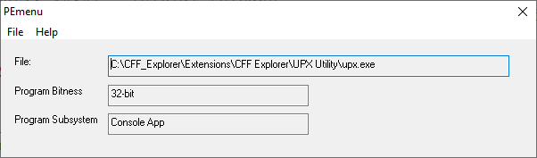

# PEmenu
Let you open any Windows executable file and report to you whether it is Console/GUI and 32/64-bit app

### A simple PE analysis tool for reverse engineers

In April 2025, I created a small Win32 app (minimum requirement: Windows XP) in FASM that can let you open an executable file (e.g. EXE, DLL, SYS) and you'll get simple description such as:

1. "32-bit Console App"
2. "32-bit GUI App"
3. "64-bit Console App"
4. "64-bit GUI App"

For any other type of subsystem, it will just merely states:
1. "32-bit PE file"
2. "64-bit PE file"

I have published this program in SherpaSec cybersecurity Discord server before. To get the source code to compile, you'll need Flat Assembler for Windows.
